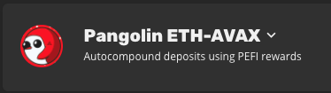

# Le bouton de réinvestissement

## Dois-je appuyer sur le bouton de réinvestissement ?

Non. Quelqu'un d'autre appuiera sur ce bouton pour vous permettre de gagner la récompense.

## Comment cela fonctionne ?

Le bouton de réinvestissement prend toutes les récompenses en attente d'une pool, les convertit en actif de la ferme, et les réinvestit dans le pool pour composer les dépôts de tous les membres de la ferme.

Il y a une récompense variable pour inciter les utilisateurs à appuyer sur ce bouton. Celui qui est le premier à appuyer sur le bouton, gagne la récompense et compose les dépôts de tout le monde.

## Quand faut-il appuyer sur ce bouton ?

Le bouton de réinvestissement est facultatif. Vous n'êtes pas obligé d'appuyer dessus. Cependant, vous pouvez être motivé à appuyer sur ce bouton afin de gagner la récompense.

Si votre objectif est de réaliser un gain net en AVAX, vous devez alors prendre en compte le ratio jeton de récompense / prix de l'AVAX, le coût de transaction pour réinvestir pour cette pool en particulier, le coût de transaction pour échanger le jeton de récompense en AVAX, etc.

Il n'est pas nécessaire de participer à la pool pour pouvoir recevoir la récompense de réinvestissement. Toute personne qui appuie sur le bouton et effectue la transaction recevra la récompense. En gardant cela à l'esprit, cela peut être compétitif, alors assurez-vous d'être rapide.

## Exemple de processus de réinvestissement

Par exemple, disons que vous êtes dans la pool ci-dessous \(Pangolin ETH-AVAX / PEFI\). 

En participant à cette pool, vous avez fourni des liquidités sur Pangolin sous forme d'ETH et d'AVAX et vous avez déposé ces jetons LP dans la ferme Yield Yak. Ces jetons LP sont ensuite déposés sur Penguin Finance et les récompenses pour cette pool sont données en PEFI.

Un réinvestisseur appuie sur le bouton lorsqu'il y a un solde en attente de 100 PEFI.

* Le réinvestisseur collecte 3 PEFI \(récompense de 3%\).
* Le trésorier collecte 5 PEFI \(récompense de 5%\)
* Les PEFI restants sont réinvestis

Les PEFI restants sont vendus contre des ETH et des AVAX, ajoutés aux jetons de Pangolin LP, puis redéposés dans le pool.

## Plus d'informations

### Mécanisme de protection

La fonction de réinvestissement contient un mécanisme de protection afin de limiter la vitesse à laquelle deux réinvestissements peuvent se produire à la suite. Par conception, la deuxième transaction \(qui ne reçoit presque aucune récompense\) doit échouer à un coût en gaz très faible \(~0,03 AVAX\) au lieu d'être exécutée avec la pleine utilisation du gaz.

Si vous ne recevez presque aucune récompense parce que quelqu'un d'autre a été légèrement plus rapide et que votre transaction a réussi, veuillez suggérer à notre équipe une modification de cette configuration.

### Échec de la transaction

Si vous rencontrez un échec de transaction après avoir appuyé sur le bouton de réinvestissement, cela est normalement dû à l'une des deux raisons suivantes :

1. D'une manière ou d'une autre, vous avez réussi à soumettre une transaction alors que la récompense en jetons était inférieure au seuil minimum. Les frais \(gaz\) sont cependant relativement faibles. \(~0.03 AVAX\).
2. D'une manière ou d'une autre, la limite de gaz par défaut pour le réinvestissement n'est pas suffisante pour la transaction. Vous devrez peut-être augmenter manuellement la limite de gaz. Si vous échouez, vous risquez de devoir payer la totalité de la limite de gaz par défaut.

### Frais

Des frais sont perçus à chaque fois qu'une ferme est composée, à partir des tokens de récompense.

Les frais sont généralement compris entre 5 et 10 % des tokens de récompense. Les frais sont variables et changent en fonction des conditions du réseau pour optimiser les récompenses. Il existe trois catégories de frais :

1. **Récompense de réinvestissement** - payée au réinvestisseur qui appuie sur le bouton.
2. **Frais d'administration** - payés au réseau
3. **Frais de développement** - payés au développeur qui a écrit la stratégie.

Yak Yield n'applique aucun frais de dépôt ou de retrait \(bien que les exploitations sous-jacentes puissent le faire\).

  

