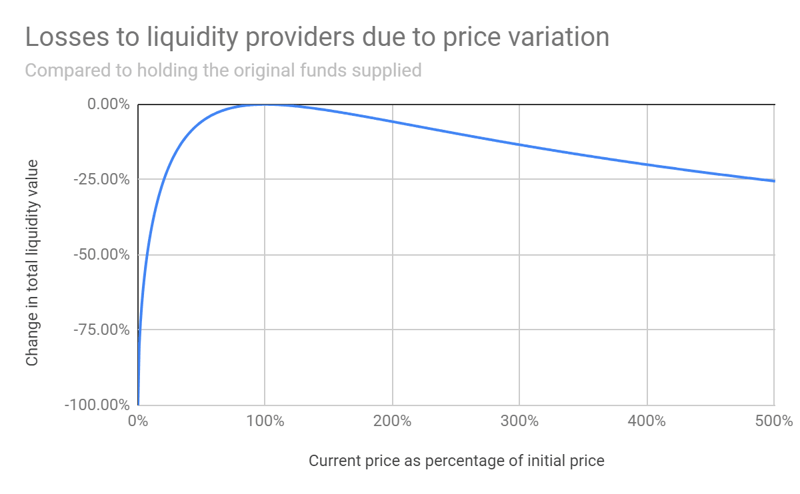

# Pérdida Temporal

Cuando un farmer proporciona liquidez en un AMM, los dos activos son depositados con una relación de 50:50 de su valor entre sí \(al momento de depositar\). Los protocolos AMM son controlados por fórmulas matemáticas complejas que ajustan las tasas de los activos subyacentes en el fondo mientras que también determinan sus precios. Mientras el valor de AVAX y ETH fluctúa el AMM ajustará la tasa de farmers LP para asegurar que permanezcan a un valor de 50:50. Esto significa que un farmer puede salir perdiendo ganancias de un activo depositado que tenga mejor rendimiento. 

Así que, para los fines de este ejemplo asumamos que 1 ETH = 100 AVAX & 100 AVAX = 1 ETH. El farmer proporciona liquidez en un AMM y deposita 100 AVAX y 1 ETH y recibe el token de “recepción” \(LP\) que puede ser depositado luego en Yield Yak para combinar automáticamente. En el caso que el precio de AVAX comience a incrementarse mientras más y más personas estén comprando AVAX. En este caso, el fondo ajusta la tasa para asegurar que el valor permanezca dividido 50:50 entre AVAX y ETH. 

Ahora 1 ETH vale repentinamente solo 50 AVAX debido al salto del precio en AVAX. Pero porque el protocolo ajustó automáticamente el monto de los tokens en el fondo, el farmer sale perdiendo en el repunte de AVAX.

Esto es pérdida temporal. Si el precio de ETH y AVAX fluctúa en línea entre si entonces no se realiza ninguna PT. Pero si el precio de uno de los dos activos se incremente entonces el farmer sale perdiendo.

En el ejemplo de arriba el farmer hubiese estado mejor simplemente manteniendo su AVAX/ETH si remueven la liquidez del fondo AMM.

Sin embargo, si el farmer permanece en el fondo y el valor de AVAX vuelve a bajar a su valor original entonces el valor de las existencias globales del farmer también regresará a su valor original y tendrán 100 AVAX & 1 ETH \(o aún más ¡si depositaron sus tokens LP en Yield Yak!\).  

Recuerde, las Pérdidas Temporales solo se vuelven permanente una vez que ha removido su liquidez.

## ¿Cómo protegerse contra la PT?

One way in which you can reduce your exposure to IL is to provide liquidity for pairs where the relative price of each asset remains fairly constant. For example, a stablecoin pair like DAI-USDT would give you very little exposure to IL.

El lado negativo de estos fondos sin embargo es que no gana ningún beneficio del incremente de precio, el número de estos fondos es menor y las ganancias pueden ser no tan atractivas como otros fondos.

