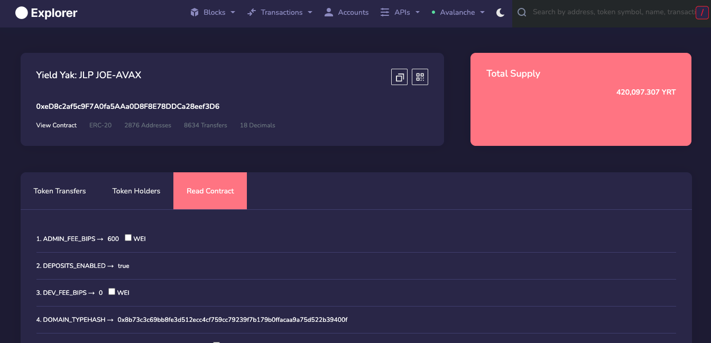
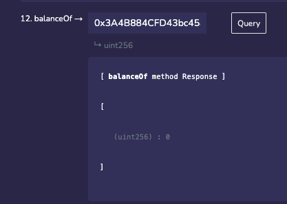
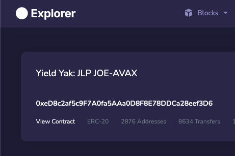
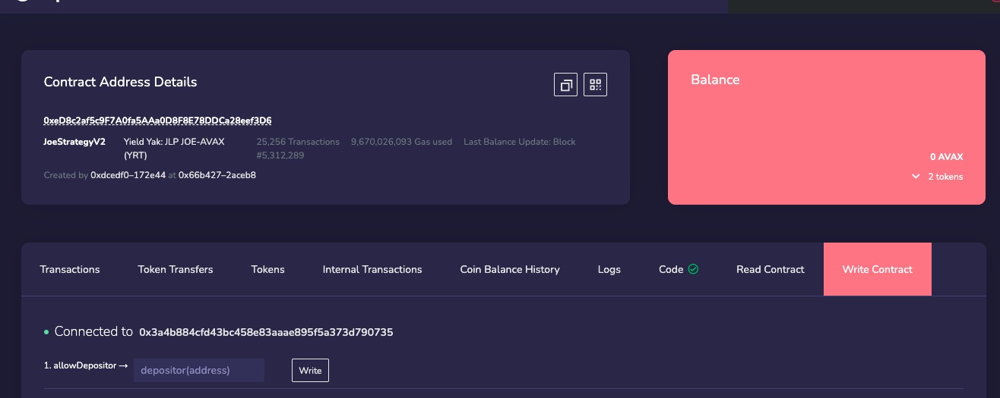
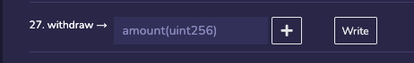

# Emergency Withdrawal

In the event that you are unable to interact with http://yieldyak.com UI for whatever reason, you may need to conduct a withdrawal from the contract. Below, you will find a helpful guide on how to interact with Yield Yak farms and contracts directly from the explorer.

## Step 1. Locate the particular farm you wish to remove your LP from

Open your wallet on C-Chain Explorer: [https://cchain.explorer.avax.network/](https://cchain.explorer.avax.network) and click on the 'Tokens' tab. Scroll down until you find the YRT tokens for the farm you wish to withdraw from and click the link to the right hand side of 'YRT'. In the below example, click the link 'JoeStrategyV2 (0xed8c2a–eef3d6)'.

## Step 2: Read Contract and balance

Once the page for that contract loads, click on the 'Read Contract' tab:

Scroll down until you get to the 'balanceOf' field. Enter your wallet address and hit 'Query'. This will output your balance. Copy the number you see after '(unit256) : '.

## Step 3: Write contract and withdraw

Scroll up to the top of the page and click 'View Contract':

On the subsequent page, click on the 'Write Contract' tab (far right):

Scroll down until you see 'withdraw' and paste the number from the previous page in to this field and hit 'write'.

You will have to approve this transaction in Metamask (or whichever wallet you are using).&#x20;

You now have your LP tokens in your wallet.
