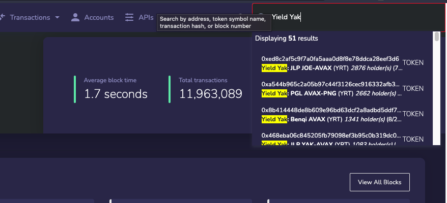

# Emergency Withdrawal How-to

In the event that you are unable to interact with http://yieldyak.com for whatever reason, you will find a helpful guide on how to interact with Yield Yak farms and contracts directly from the explorer.

## Step 1. Locate the particular farm you wish to remove your LP from

Go to C-Chain Explorer: [https://cchain.explorer.avax.network/](https://cchain.explorer.avax.network/) and in the search bar \(top right\) type 'Yield Yak'. It should look like this: Scroll down until you find your farm or enter more text in the search to refine the results.

## Step 2: Read Contract and balance

Once you've located the contract click on it and go to the 'Read Contract' tab:

Scroll down until you get to the 'balanceOf' field. Enter your wallet address and hit 'Query'. This will output your balance. Copy the number you see after '\(unit256\) : '.

## Step 3: Write contract and withdraw

Scroll up to the top of the page and click 'View Contract':

On the subsequent page click on the 'Write Contract' tab on the far right:

Scroll down until you see 'withdraw' and paste the number from the previous page in to this field and hit 'write'.

You will have to approve this transaction in Metamask \(or whichever wallet you are using\). 

You now have your LP tokens in your wallet.

