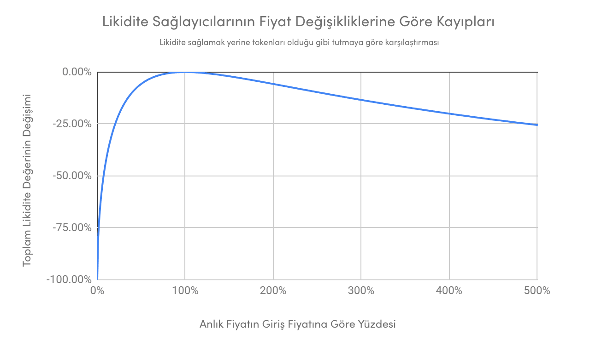

# Geçici Kayıp

Bir likidite sağlayıcısı havuza girdiğinde işlem çiftlerinin birbirlerine karşı oranları 50:50 oranında eşit olur. Otomatize Pazar Yapıcı protokolü, kompleks matematiksel formüllerle çiftlerin birbirine oranını düzenlerken fiyatı da belirler. AVAX ve ETH fiyatları hareket ettikçe OPY\(Otomatize Pazar Yapıcı\), havuz likidite sağlayıcılarının AVAX ve ETH oranlarını düzenleyerek oranın 50:50 kalmasını sağlar. Bu yüzden likidite sağlayıcı fiyatı artan tokenın getirisini kaçırabilir.

Gelin bir örnekle inceleyelim bu konuyu, diyelim ki 1 ETH = 100 AVAX & 100 AVAX = 1 ETH. Likidite sağlayıcı, havuza 100 AVAX ve 1 ETH ekler ve karşılığında havuz tokenları\(örneğin, $PGL\) alsın. Ve bu aldığı havuz tokenlarını Yield Yaka birleşik getiri almak için yatırsın. İnsanlar ETH'ye karşı AVAX aldıkça AVAX'ın fiyatı artar. Bu durumda havuz işlem çifti tokenların oranını, artan fiyata göre düzenleyerek ETH-AVAX oranının 50:50 olarak kalmasını sağlar. 

Son artıştan dolayı artık 1 ETH 50 AVAX'a eşit olur. Ve havuz, otomatik olarak havuzdaki token sayısını düzenlediği için likidite sağlayıcı AVAX rallisinden geri kalacaktır.

İşte bunun adı geçici kayıptır. Eğer ETH ve AVAX fiyatları birbirlerine uyumlu olarak artıp azalsaydı GK hiç gerçekleşmezti. Ancak ikiliden biri daha çok arttığı için likidite sağlayıcısı kayba uğradı.

Yukarıdaki örnek üzerinden inceleyecek olursak likidite sağlayıcı tokenlarını havuzdan çıkararak AVAX ve ETH olarak tutsaydı daha kârlı bir karar vermiş olurdu. 

Ancak likidite sağlayıcı havuzdan çıkmayıp beklerse ve AVAX fiyatı tekrar eski yerine dönerse likidite sağlayıcının tokenlarıda eski oranına geri döner ve anaparasının değeri de ilk haline döner. \(hatta tokenlarını Yield Yak'ta tutuyorsa daha fazlasına bile sahip olabilir\)

Unutmayın, geçici kayıplarınız ancak havuzdan çıktığınız takdirde kalıcı olacaktır. 

## Geçici Kayba Karşı Kendinizi Nasıl Koruyabilirsiniz?

GK'nın etkilerine karşı kendinizi korumanızın bir yolu da, fiyatın birbirlerine karşı görece olarak uyumlu olduğu çiftleri seçmeniz olabilir. Örneğin DAI-USDT gibi bir stabil coin çifti sizi GK'ya karşı ciddi olarak koruyacaktır. 

Bu çiftlerin dezavantajı ise hem stabil oldukları için fiyat artışlarından faydalanamamanız hem de bu havuzların getirilerinin diğer havuzlara nazaran daha az olması olacaktır.

